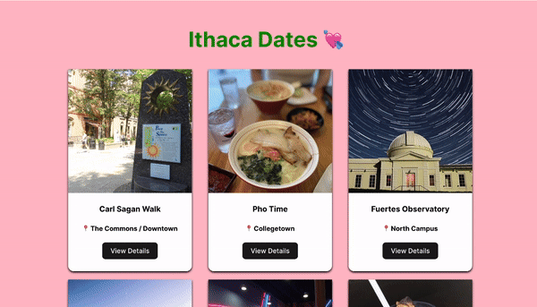

# Web Development Project 1 - Ithaca Date Spots

Submitted by: Daniel Chuang

This web app: Was created to help college students in Ithaca find nice spots to go on dates! It was created with a React and Node stack.

Time spent: 4 hours spent in total

## Required Features

The following **required** functionality is completed:

- [x] **There is a unique theme for events or resources relevant to a specific community**
- [x] **At least 10 unique resources or events are displayed in a responsive card format**

The following **optional** features are implemented:

- [x] Buttons or links to a related resources are on each card component
- [ ] The site is responsive for both desktop and mobile formats

The following **additional** features are implemented:

- [x] Added a nice drop shadow in the background!
- [x] Made it so that buttons bring you to a new page
- [x] Refactored so that the props data are passed through an array of data, rather
      than hard coded into the Event components

## Video Walkthrough

Here's a walkthrough of implemented required features:

<!-- Replace this with whatever GIF tool you used! -->

GIF created with OBS and EZGif for conversion

<!-- Recommended tools:
[Kap](https://getkap.co/) for macOS
[ScreenToGif](https://www.screentogif.com/) for Windows
[peek](https://github.com/phw/peek) for Linux. -->

## Notes

It took me some time to format the flexboxes correctly, since it has been a while since I've used those.

It also took me some time to get use to the React syntax, but by looking at example from our lecture + lab I was able to figure it out!

## License

    Copyright [yyyy] [name of copyright owner]

    Licensed under the Apache License, Version 2.0 (the "License");
    you may not use this file except in compliance with the License.
    You may obtain a copy of the License at

        http://www.apache.org/licenses/LICENSE-2.0

    Unless required by applicable law or agreed to in writing, software
    distributed under the License is distributed on an "AS IS" BASIS,
    WITHOUT WARRANTIES OR CONDITIONS OF ANY KIND, either express or implied.
    See the License for the specific language governing permissions and
    limitations under the License.
